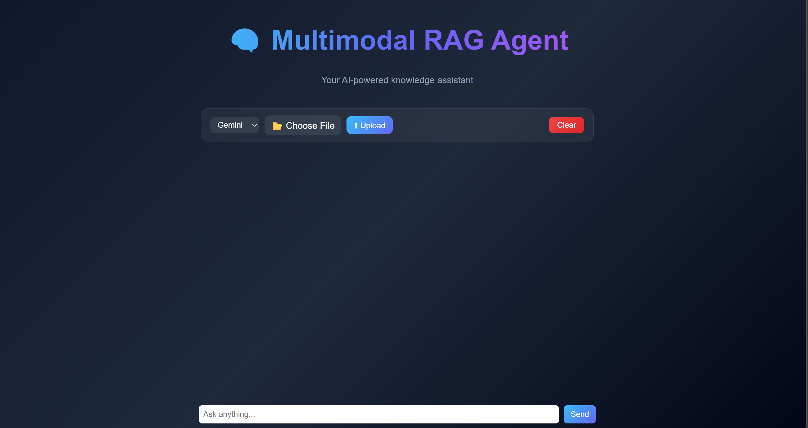

# 🚀 Multimodel RAG Agent

### 🧠 Enterprise AI Copilot for Intelligent Document Q&A


---

<p align="center">
  
</p>

## 🌟 Overview

**Multimodel RAG Agent** is an AI-powered system that combines **Retrieval-Augmented Generation (RAG)** with modern web technologies to deliver intelligent, context-aware responses from documents.

It allows users to:

* 📄 Upload documents
* 🔍 Perform semantic search
* 🤖 Ask natural language questions
* ⚡ Get AI-generated answers with context

---

## 🧠 What is RAG?

Retrieval-Augmented Generation (RAG) enhances LLMs by:

1. Retrieving relevant data from a knowledge base
2. Feeding it into the model
3. Generating accurate and context-aware responses

---

## 🏗️ Architecture

```
User Query
   ↓
Frontend (React UI)
   ↓
FastAPI Backend
   ↓
Embedding Model
   ↓
Vector Database (FAISS)
   ↓
Retriever (Top-K Results)
   ↓
LLM (Response Generation)
   ↓
Final Answer
```

---

## ⚙️ Tech Stack

### 🔹 Backend

* FastAPI ⚡
* Python 🐍
* FAISS (Vector Database)
* Custom RAG Pipeline

### 🔹 Frontend

* React.js ⚛️
* Axios (API Calls)

### 🔹 AI Components

* Embeddings Model
* LLM (OpenAI / Gemini / etc.)

---

## 🧠 Future Improvements

* 🔥 Add streaming responses
* 📊 Dashboard analytics
* ☁️ Cloud deployment (Render/Vercel)
* 📚 Multi-document memory
* 🎤 Voice input support

---

## 👨‍💻 Author

**Ansh**
